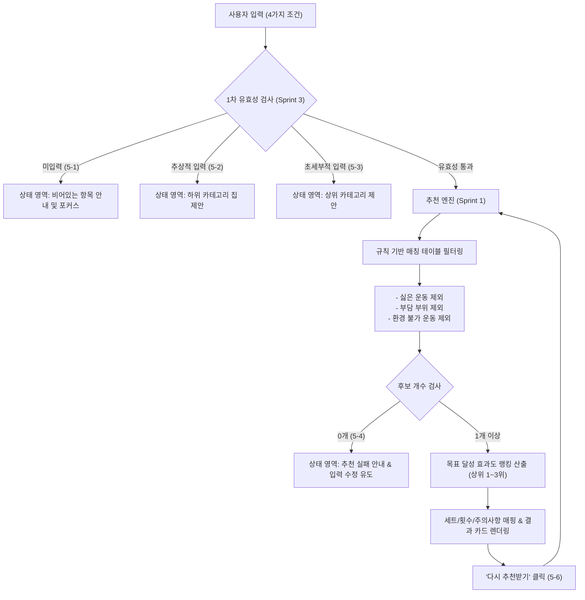

# 📋 운동 대체 추천 서비스 - 스프린트 기반 개발 계획서
> **관련 문서**: [PRD.md](file:///c:/zip/PRD.md)  
> **버전**: v1.0.0  
> **작성일**: 2026-08-26  
> **목표 일정**: 총 5시간 내 프로토타입 구현 및 검증 완료  

---

## 1. 개요 및 개발 원칙

### 1.1 프로젝트 개요
사용자가 **운동 목표**, **싫은 운동**, **피하고 싶은 부위**, **운동 환경**의 4가지 조건을 입력하면, 규칙 기반 매칭 알고리즘을 통해 해당 부위/운동을 제외한 최적의 대체 운동을 5초 이내에 1~3위 순위로 추천하는 단일 화면 웹 서비스입니다.

### 1.2 핵심 개발 원칙
1. **단일 화면 완결성**: 로그인, 결제, DB, 복잡한 라우팅 없이 순수 클라이언트 기반으로 1개 스크롤 화면에서 입력→로딩→결과→재요청 흐름을 완결합니다.
2. **PRD 100% 충실성**: PRD의 6대 예외 상황(5-1 ~ 5-6) 및 완료 조건(DoD)을 명시적인 테스트 케이스와 코드로 구현합니다.
3. **스프린트 단위 분할 개발**: 기능 간 의존성을 고려하여 데이터 모델링 → 엔진 구현 → UI/UX 완성 → 예외 처리 → 통합 검증 순으로 단계별 점진적 개발이 가능하도록 구성합니다.

---

## 2. 시스템 아키텍처 및 데이터 흐름



---

## 3. 스프린트 상세 계획

```mermaid
gantt
    title 운동 대체 추천 서비스 스프린트 타임라인 (총 5시간)
    dateFormat  HH:mm
    axisFormat %H:%M
    section Sprint 0
    데이터 모델링 & 규칙 매핑 정의 :done, s0, 00:00, 45m
    section Sprint 1
    핵심 추천 엔진 알고리즘 구현 :active, s1, after s0, 60m
    section Sprint 2
    단일 화면 UI 및 인터랙션 구현 :s2, after s1, 60m
    section Sprint 3
    6가지 예외 처리 및 상태 피드백 시스템 :s3, after s2, 75m
    section Sprint 4
    통합 검증, DoD 점검 및 배포 준비 :s4, after s3, 60m
```



---

### 🏃 Sprint 0: 데이터 모델링 및 규칙 매핑 체계 정립
* **예상 소요 시간**: 45분
* **목표**: 운동 카탈로그 데이터베이스, 신체 부위 계층 트리(대/중/소), 운동 환경 및 목표 매핑 테이블 구축

#### 📌 주요 작업 내용
1. **신체 부위 계층 트리(Category Tree) 구축 (`lib/taxonomy.ts`)**
   - 대분류(추상적): `다리`, `팔`, `상체`, `하체` (예외 5-2 트리거)
   - 중분류(표준 매칭 단위): `무릎`, `허벅지`, `종아리`, `발목`, `어깨`, `손목`, `허리`, `가슴`, `등`, `복부`
   - 소분류(초세부적): `손목관절`, `아킬레스건`, `전방십자인대`, `요추4번`, `회전근개` (예외 5-3 트리거 및 상위 매핑)
2. **운동 카탈로그 데이터베이스 구축 (`lib/workout-database.ts`)**
   - 30종 이상의 실질적 운동 데이터 정의
   - 속성: ID, 운동명, 주요 목표(`체중감량` | `근력강화` | `유연성` | `체력증진`), 운동 환경(`홈트` | `헬스장` | `야외`), 자극/부담 부위 배열(`burdenParts`), 제외 키워드 매핑, 효과도 점수(1~10), 세트/횟수 템플릿, 주의사항 텍스트
3. **타입 정의 및 유틸리티 설정 (`lib/types.ts`)**

#### ✅ 완료 기준 (Acceptance Criteria)
* [ ] 대분류/중분류/소분류 간 양방향 매핑 함수 제공
* [ ] 4개 운동 목표 및 3개 환경별로 최소 5개 이상의 대체 후보 운동 확보

---

### 🏃 Sprint 1: 핵심 추천 엔진 및 규칙 매칭 알고리즘 구현
* **예상 소요 시간**: 60분
* **목표**: PRD 4장의 6단계 규칙 기반 필터링 및 랭킹 엔진 구현

#### 📌 주요 작업 내용
1. **필터링 파이프라인 구현 (`lib/recommendation-engine.ts`)**
   - **Step 1: 환경 필터링**: 사용자가 선택한 환경(`홈트`, `헬스장`, `야외`)에서 가능한 운동만 추출
   - **Step 2: 싫은 운동 필터링**: 싫은 운동 텍스트/태그와 일치하거나 유사한 운동 제외
   - **Step 3: 부담 부위 필터링**: 피하고 싶은 부위에 자극/충격이 가는 운동 제외 (예: 무릎 통증 시 런닝, 스쿼트 등 제외)
2. **효과도 랭킹 및 상위 N개 추출**
   - 목표 적합도(Relevance Score) 계산
   - 상위 1~3위 우선순위 부여 (`rank: 1, 2, 3`)
   - 세트/횟수(`volume`), 주의사항(`caution`), 태그 뱃지 생성
3. **"다시 추천받기" 다양성 풀(Pool) 로직 (PRD 5-6)**
   - 동일 입력값 재요청 시, 기존 상위 결과 외에 차순위 고효과 운동을 대체 추천하거나 가중치 셔플 적용
4. **추천 엔진 단위 테스트(Unit Tests) 작성 (`__tests__/engine.test.ts`)**
   - 무릎 회피 하체 운동 추천 테스트
   - 런닝 회피 유산소 운동 추천 테스트
   - 홈트 환경 필터링 테스트
   - 조건 불일치 시 0개 반환 테스트

#### ✅ 완료 기준 (Acceptance Criteria)
* [ ] 입력값 4개 전달 시 5초 이내에 1~3위 결과 리스트 반환
* [ ] 필터링된 결과에 회피 부위/싫은 운동이 100% 미포함됨을 단위 테스트로 검증

---

### 🏃 Sprint 2: 단일 화면 UI 및 인터랙션 구현
* **예상 소요 시간**: 60분
* **목표**: PRD 3장의 화면 명세에 따른 단일 스크롤 UI 컴포넌트 완성

#### 📌 주요 작업 내용
1. **입력 영역 (① 영역) 컴포넌트 고도화**
   - **운동 목표**: 칩 선택형 (`체중감량`, `근력강화`, `유연성`) + `기타 직접입력` 인풋
   - **싫은 운동**: 태그 인풋 + 다빈도 추천 칩 (`런닝`, `버피`, `줄넘기`, `플랭크` 등)
   - **피하고 싶은 부위**: 태그 인풋 + 주요 부위 칩 (`무릎`, `허리`, `어깨`, `손목`, `발목` 등)
   - **운동 환경**: 3단 세그먼트/칩 (`홈트`, `헬스장`, `야외`)
2. **실행 버튼 (② 영역)**
   - 대형 CTA "추천받기" 버튼 (로딩 상태 애니메이션 지원)
3. **결과 카드 영역 (④ 영역)**
   - 1~3위 순위 뱃지 (1위 Gold, 2위 Silver, 3위 Bronze)
   - 운동명, 추천 사유, 세트/횟수, 주의사항(`caution`) 박스
   - 하단 "다시 추천받기" 버튼
4. **반응형 웹 디자인 & 다크/라이트 테마 최적화**

#### ✅ 완료 기준 (Acceptance Criteria)
* [ ] 단일 화면 내에 4개 영역(①~④)이 일목요연하게 배치
* [ ] 데스크톱 및 모바일 뷰포트에서 스크롤 깨짐 없이 동작

---

### 🏃 Sprint 3: 6가지 예외 처리 및 상태 피드백 시스템 구현
* **예상 소요 시간**: 75분
* **목표**: PRD 5장의 예외 케이스(5-1 ~ 5-6) 완벽 처리 및 상태 표시 영역(③) 연동

#### 📌 주요 작업 내용
1. **예외 5-1: 입력 누락 검증 (Empty Fields)**
   - 4개 입력값 중 빈 항목 탐지
   - 안내 문구 출력: `"{항목명}을(를) 입력해주세요"`
   - 해당 입력 필드로 자동 스크롤 및 포커스 이동, 시각적 하이라이트
2. **예외 5-2: 추상적 입력 처리 (Too Broad)**
   - `다리`, `팔`, `상체`, `하체` 등 대분류 단어 입력 감지
   - 안내 문구: `"'다리'는 범위가 넓어요. 허벅지 / 종아리 / 발목 중 더 구체적으로 입력해주세요"`
   - 하위 선택지 칩 원클릭 추가 기능 지원
3. **예외 5-3: 초세부적 입력 처리 (Too Specific)**
   - `손목관절`, `전방십자인대` 등 세부 단어 감지
   - 안내 문구: `"입력이 너무 세부적이에요. '손목' 정도로 조금 더 넓게 입력해주세요"`
   - 상위 대체어 원클릭 치환 지원
4. **예외 5-4: 매칭 실패 처리 (Zero Matches)**
   - 과도한 필터링으로 후보 0개 발생 시
   - 안내 문구: `"추천을 만들지 못했어요. 입력 내용을 다시 확인하고 입력해주세요"`
   - 결과 영역 비우기 및 입력 영역 포커스 복귀
5. **예외 5-5: 지연 처리 (Loading Indicator)**
   - "추천받기" 클릭 즉시 로딩 인디케이터 + `"조금만 기다려주세요"` 표시
   - 스켈레톤 UI 카드 노출 후 1~2초 내 결과 자동 전환
6. **예외 5-6: 재추천 처리 (Re-recommendation)**
   - 기존 입력값 100% 유지한 채 결과만 새 조합으로 갱신

#### ✅ 완료 기준 (Acceptance Criteria)
* [ ] 6가지 예외 상황이 화면에서 정확한 문구와 함께 재현 및 복구 가능

---

### 🏃 Sprint 4: 통합 검증, DoD 점검 및 배포/문서화
* **예상 소요 시간**: 60분
* **목표**: PRD 6장 Definition of Done 전수 검증 및 품질 최적화

#### 📌 주요 작업 내용
1. **PRD 2장 사용자 스토리 기반 E2E 시나리오 검증**
   - 시나리오 1: 무릎 통증 사용자 하체 운동 추천
   - 시나리오 2: 런닝 회피 유산소 운동 추천
   - 시나리오 3: 헬스장 기구 없는 홈트 운동 추천
   - 시나리오 4: 재추천 인터랙션 검증
2. **Definition of Done (DoD) 체크리스트 확인**
   - [ ] 단일 화면에서 입력(4개 항목) → 추천받기 → 결과(1~3위) 흐름이 새로고침 없이 동작하는가?
   - [ ] 5-1~5-6 예외 상황 6가지가 모두 화면에서 재현 및 확인 가능한가?
   - [ ] 로그인/결제/DB 저장 기능이 코드 어디에도 존재하지 않는가?
   - [ ] 결과는 순위 + 운동명 + 세트/횟수 + 주의사항 텍스트로 구성되어 출력되는가?
   - [ ] "다시 추천받기"로 입력값 유지한 채 재요청이 가능한가?
   - [ ] 전체 기능이 5시간 작업 범위 내에서 구현 완료되었는가?
3. **코드 정리 및 빌드 검증 (`npm run build`)**
4. **최종 Git 커밋 및 원격 저장소 푸시**

---

## 4. 폴더 구조 및 파일 배정 계획

```
c:\zip/
├── PRD.md                         # 제품 요구사항 정의서
├── docs/                          # [NEW] 프로젝트 관리 및 개발 문서
│   ├── README.md                  # 문서 인덱스
│   └── DEVELOPMENT_PLAN.md        # 스프린트 개발 계획서 (본 문서)
├── app/
│   ├── globals.css                # 글로벌 디자인 시스템 및 애니메이션
│   ├── layout.tsx                 # SEO 메타데이터 및 루트 레이아웃
│   └── page.tsx                   # 단일 화면 메인 페이지 (상태 오케스트레이션)
├── components/
│   ├── chip-group.tsx             # 목표/환경 선택 칩 컴포넌트
│   ├── tag-input.tsx              # 싫은 운동 / 피할 부위 태그 입력기
│   ├── status-message.tsx         # ③ 상태 표시 영역 (오류, 힌트, 로딩)
│   ├── result-card.tsx            # ④ 결과 영역 1~3위 운동 카드
│   ├── skeleton-card.tsx          # ⑤ 로딩 스켈레톤 카드
│   └── state-switcher.tsx         # 테스트/검증용 상태 시뮬레이터
└── lib/
    ├── types.ts                   # 공통 데이터 타입 정의
    ├── taxonomy.ts                # 신체 부위 계층 트리 (대/중/소분류)
    ├── workout-database.ts        # 운동 카탈로그 데이터베이스 (30+ 종)
    ├── recommendation-engine.ts   # 규칙 기반 필터링 및 랭킹 알고리즘
    └── utils.ts                   # UI 유틸리티
```

---

## 5. 리스크 관리 및 대응 방안

| 리스크 요인 | 발생 확률 | 영향도 | 대응 방안 |
|---|---|---|---|
| 복합 회피 조건으로 인한 후보 운동 0개 빈발 | 중 | 높음 | 카탈로그 내 운동 수를 충분히 확보(30종 이상)하고, 매칭 불가 시 5-4 안내와 함께 완화 가이드 제공 |
| 비표준 신체 부위 입력 시 오인식 | 중 | 보통 | 동의어 사전(`동의어/유의어 매핑`) 및 사전 정의된 칩 제안으로 정규화 유도 |
| 브라우저 렌더링 지연 | 낮음 | 낮음 | 가벼운 순수 React 상태 기반 렌더링으로 5초 이내 즉각 응답 보장 |
